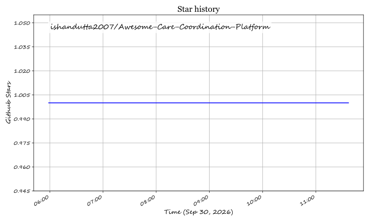

<p align="center">
  
</p>

# 🏥 Awesome Care Coordination Platform

<p align="center">
  <a href="https://github.com/ishandutta2007/Awesome-Awesome-Awesome"></a>
  <a href="https://discord.gg/jc4xtF58Ve"></a>
  <a href="https://github.com/ishandutta2007/Awesome-Care-Coordination-Platform/stargazers"></a>
  <a href="https://github.com/ishandutta2007/Awesome-Care-Coordination-Platform/network/members"></a>
  <a href="https://github.com/ishandutta2007/Awesome-Care-Coordination-Platform/blob/main/LICENSE"></a>
  <a href="https://github.com/ishandutta2007"></a>
</p>

## 📌 Top Care Coordination Platforms Ecosystem

**Curated List of SaaS Products & Open-Source GitHub Projects**  
*Focused on Cross-Organizational Referrals, Closed-Loop Communication, Community Health Work & Population Health Management*  
**Last updated: September 2026** 🗓️

This repository tracks notable **SaaS platforms** ☁️ and **open-source projects** 🔓 for **Care Coordination** in healthcare IT. These tools help healthcare organizations, health plans/payers, and community-based organizations (CBOs) coordinate patient care across settings, enabling closed-loop referrals, shared care plans, and cross-organizational HL7 FHIR data exchange.

---

## 📑 Table of Contents

- [📊 Market Overview & Industry Dynamics](#-market-overview--industry-dynamics)
- [☁️ SaaS & Enterprise Hosted Platforms](#%EF%B8%8F-saas--enterprise-hosted-platforms)
- [🔓 Open-Source GitHub Projects](#-open-source-github-projects)
- [🤝 How to Contribute](#-how-to-contribute)
- [💖 Support & Sponsorship](#-support--sponsorship)
- [⚠️ Disclaimer](#%EF%B8%8F-disclaimer)
- [📈 Star History](#-star-history)

---

## 📊 Market Overview & Industry Dynamics

> 💡 **Market Size & Structure**: The global Care Coordination Software market is estimated at **$5.2 Billion in 2026** and is projected to reach **$11.8 Billion by 2030** (CAGR ~17.8%). The market is **moderately fragmented**, with enterprise healthcare IT giants (Innovaccer, WellSky, Arcadia) dominating population health management and risk stratification, while specialized networks (Unite Us, Findhelp) lead social care referrals. High integration barriers and localized referral networks create distinct regional strongholds rather than a single winner-take-all environment.

---

## ☁️ SaaS & Enterprise Hosted Platforms

Below is a curated comparison of leading commercial care coordination, population health, and social care referral SaaS platforms, sorted by estimated company scale (annual revenue/valuation):

| Platform | Description & Core Focus | Company Scale (Rev / Val) 🏢 | Starting Pricing Tier 💰 | Free Tier / Trial Limit 🎁 |
| :--- | :--- | :--- | :--- | :--- |
| **[Innovaccer](https://innovaccer.com/)** | Enterprise healthcare data activation platform unifying payer/provider data for risk stratification, care gap closure, and population health. | ~$3.45B Valuation / ~$250M ARR | ~$15,000 / month base platform fee | 30-Day Sandbox Trial (Developer Portal access) |
| **[WellSky / CarePort](https://wellsky.com/)** | Comprehensive post-acute care coordination platform connecting hospitals, PAC providers, and payers for real-time patient referrals and ADT event tracking. | ~$3.00B Valuation / ~$1.60B Revenue | ~$10,000 / month hospital module | 14-Day Enterprise Demo Sandbox |
| **[Unite Us](https://uniteus.com/)** | Cross-sector social care coordination network connecting healthcare providers with CBOs for social needs screening and closed-loop referrals. | ~$1.60B Valuation / ~$107.9M Revenue | ~$5,000 / month organization tier | Free for verified Community-Based Organizations (CBOs) |
| **[Arcadia](https://arcadia.io/)** | Population health analytics and care management platform providing predictive risk modeling, quality measure performance, and workflow automation. | ~$100M+ Annual Revenue | ~$3,500 / month clinic plan | 30-Day Guided Analytics Sandbox |
| **[ZeOmega](https://zeomega.com/)** | Enterprise population health management platform (Jiva) offering care management, utilization management, and risk adjustment for payers/providers. | ~$147.4M Annual Revenue | ~$8,000 / month plan tier | 14-Day Managed Demo Access |
| **[Bamboo Health](https://bamboohealth.com/)** | Real-time care collaboration network delivering admission, discharge, and transfer (ADT) event notifications across thousands of care settings. | ~$120.0M Annual Revenue | ~$2,500 / month facility access | 30-Day Regional Partner Trial |
| **[Findhelp](https://findhelp.org/)** | Social care referral network connecting individuals and health systems to social safety net programs with end-to-end outcome tracking. | ~$37.5M Annual Revenue | ~$1,200 / month enterprise tier | Free Forever Plan for public users & CBO search/referrals |
| **[Aidin](https://aidin.com/)** | Care transitions management platform streamlining post-acute referrals and hospital discharge planning for healthcare staff. | ~$14.8M Annual Revenue | ~$800 / month provider seat | Free Access Plan for post-acute receiving providers |

---

## 🔓 Open-Source GitHub Projects

The open-source ecosystem for care coordination is production-ready across community care, FHIR infrastructure, and SMART-on-FHIR care planning. Projects are sorted by GitHub Stars_Count (descending) 🌟:

### 🌟 Open-Source Options (Sorted by Stars)

1. **[Synthea™](https://github.com/synthetichealth/synthea)**
   [](https://github.com/synthetichealth/synthea/stargazers)  
   **Synthetic Patient Population Simulator**. Generates realistic, synthetic patient records and longitudinal care plans in FHIR R4/CCDA formats. Invaluable for testing care management workflows and referral pipelines without HIPAA constraints.  
   `License: Apache-2.0` | `Tech: Java`

2. **[HAPI FHIR](https://github.com/hapifhir/hapi-fhir)**
   [](https://github.com/hapifhir/hapi-fhir/stargazers)  
   **Complete Open-Source HL7 FHIR Storage & Messaging Server for Java**. The industry standard data engine powering custom care plan servers (`CarePlan`, `Task`, `ServiceRequest` FHIR resources) and clinical data repositories.  
   `License: Apache-2.0` | `Tech: Java`

3. **[OpenMRS Core](https://github.com/openmrs/openmrs-core)**
   [](https://github.com/openmrs/openmrs-core/stargazers)  
   **Enterprise Open-Source Electronic Medical Record (EMR) System Platform**. Deployed in thousands of clinics globally across developing regions; supports clinical encounter tracking, patient workflows, and care coordination plugins.  
   `License: MPL-2.0` | `Tech: Java`

4. **[Microsoft FHIR Server](https://github.com/microsoft/fhir-server)**
   [](https://github.com/microsoft/fhir-server/stargazers)  
   **Enterprise FHIR Server Engine for Azure**. Provides RESTful API endpoints for FHIR R4 & STU3 resources. Serves as a robust backend store and interoperability bridge for complex multi-organization care coordination systems.  
   `License: MIT` | `Tech: C# / .NET`

5. **[Community Health Toolkit (CHT)](https://github.com/medic/cht-core)**
   [](https://github.com/medic/cht-core/stargazers)  
   **Digital Public Good for Community Health Workers (CHWs)**. Supports ~40,000 CHWs across 15 countries with over 85M care activities. Features offline-first mobile apps, decision-support workflows, longitudinal person profiles, task scheduling, and FHIR alignment.  
   `License: AGPL-3.0` | `Tech: JavaScript / Node.js`

6. **[Microsoft FHIR-Converter](https://github.com/microsoft/FHIR-Converter)**
   [](https://github.com/microsoft/FHIR-Converter/stargazers)  
   **Healthcare Data Transformation Engine**. Converts legacy healthcare formats (HL7 v2, C-CDA, JSON) into FHIR bundles. Facilitates ingesting legacy clinical feeds into modern care coordination platforms.  
   `License: MIT` | `Tech: C# / .NET`

7. **[FHIR Core / OpenSRP 2](https://github.com/opensrp/fhircore)**
   [](https://github.com/opensrp/fhircore/stargazers)  
   **Mobile-First Offline-Capable Digital Health & Care Coordination App**. Built on Kotlin and Android FHIR SDK. Designed for care teams implementing WHO Smart Guidelines, patient management, and field care coordination.  
   `License: Apache-2.0` | `Tech: Kotlin / Android`

8. **[ORCA (Santeon)](https://github.com/SanteonNL/orca)**
   [](https://github.com/SanteonNL/orca/stargazers)  
   **Open-Source Shared Care Planning Reference Implementation**. Implements FHIR Workflow Task and Shared Care Planning specifications enabling independent health organizations to coordinate care plans across EHR boundaries.  
   `License: Apache-2.0` | `Tech: TypeScript`

9. **[SPICE (Medtronic LABS)](https://github.com/Medtronic-LABS/spice-server)**
   [](https://github.com/Medtronic-LABS/spice-server/stargazers)  
   **Digital Public Good for Community Care Coordination**. Deployed in 6 countries (500k+ patients screened). Features closed-loop referral management between community health workers and health facilities, clinical decision support, and DHIS2 interoperability.  
   `License: BSD-3-Clause` | `Tech: Java`

10. **[careplan-service (REAN Foundation)](https://github.com/REAN-Foundation/careplan-service)**
    [](https://github.com/REAN-Foundation/careplan-service/stargazers)  
    **Microservice API for Care Plan Lifecycle Management**. Provides full lifecycle REST APIs for authoring care plans, scheduling interventions, enrolling participants, and dispatching care tasks.  
    `License: MIT` | `Tech: TypeScript`

11. **[TPT Healthcare NZ](https://github.com/tpt-solutions/tpt-healthcare-nz)**
    [](https://github.com/tpt-solutions/tpt-healthcare-nz/stargazers)  
    **FHIR R5 Care Management & Integration Platform**. High-performance Go backend with React UI, supporting multi-tenant FHIR R5 resource storage, patient consent management, subscriptions, and clinical data routing.  
    `License: MIT` | `Tech: Go / React`

12. **[Matrix for Healthcare (Nuts Foundation)](https://github.com/nuts-foundation/toepassing-instante-communicatie)**
    [](https://github.com/nuts-foundation/toepassing-instante-communicatie/stargazers)  
    **Federated Clinical Team Communication Protocol**. Open specification utilizing Matrix.org protocol to map care teams to Matrix Spaces and conversations to Matrix Rooms, enabling secure cross-organizational messaging.  
    `License: CC-BY-SA-4.0` | `Tech: Specification`

---

## 🛠️ Recommended Open-Source Architecture Stack

For technical teams building custom care coordination solutions, combine these open-source building blocks:
```
  [ Community / Field Frontend ]          [ Clinical Shared Care Plan UI ]
    SPICE / CHT / FHIR Core                   AHRQ eCare Plan / ORCA
                 │                                        │
                 └───────────────────┬────────────────────┘
                                     ▼
                      [ FHIR Data Engine & API Layer ]
                    HAPI FHIR / Microsoft FHIR Server
                                     │
                 ┌───────────────────┴────────────────────┐
                 ▼                                        ▼
    [ Legacy Integration Layer ]             [ Federated Team Messaging ]
       Microsoft FHIR-Converter                     Matrix for Healthcare
```

---

## 🤝 How to Contribute

Contributions are welcome! Please follow these simple guidelines:

1. Fork 🍴 this repository.
2. Add or update entries in `README.md` following the existing format.
3. Ensure description remains factual, objective, and includes pricing/scale info if adding SaaS, or GitHub link if adding Open-Source.
4. Open a Pull Request (PR) 🚀 with a brief summary of additions.

Refer to the curated [Awesome Awesome Awesome](https://github.com/ishandutta2007/Awesome-Awesome-Awesome) list for standards.

---

## 💖 Support & Sponsorship

If you find this repository helpful for your research, healthcare IT project, or clinical workflows, please consider supporting the project:

- ⭐ **Star this repository** to help others discover it!
- 🔀 **Fork & Share** it with your healthcare tech colleagues and care coordination teams.
- ☕ **Buy me a coffee**: Support ongoing maintenance and research on GitHub Sponsors:

<p align="center">
  <a href="https://github.com/sponsors/ishandutta2007">
    
  </a>
</p>

Thank you for helping make care coordination open, transparent, and accessible! ❤️

---

## ⚠️ Disclaimer

- This is a **community-curated index** — not exhaustive and not an explicit commercial endorsement.
- Care coordination software handles Protected Health Information (PHI); verify compliance with HIPAA, GDPR, and local healthcare data regulations before deployment.

---

## 📈 Star History

[](https://star-history.dera.page/#ishandutta2007/Awesome-Care-Coordination-Platform&type=date&legend=top-left)

---

<p align="center">
  Made with ❤️ for care coordinators, population health managers, and healthcare IT engineers worldwide.
</p>

## ⭐ Star History

<a href="https://star-history.com/#ishandutta2007/Awesome-Care-Coordination-Platform&Timeline" align="center">
  <picture>
    <source media="(prefers-color-scheme: dark)" srcset="assets/ishandutta2007_Awesome-Care-Coordination-Platform_growth.svg">
    
  </picture>
</a>
